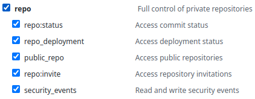
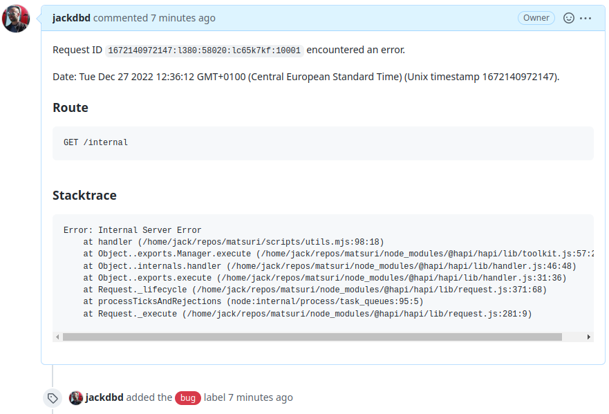

# @jackdbd/hapi-github-issue-plugin

[](https://badge.fury.io/js/@jackdbd%2Fhapi-github-issue-plugin)


Hapi plugin that automatically creates a GitHub issue when a request matches one of the rules you defined.

<!-- START doctoc generated TOC please keep comment here to allow auto update -->
<!-- DON'T EDIT THIS SECTION, INSTEAD RE-RUN doctoc TO UPDATE -->
</details>

## Installation

```sh
npm install @jackdbd/hapi-github-issue-plugin
```

## Preliminary Operations

### GitHub personal access token

This Hapi plugin makes a POST request to `{{GitHub-API}}/repos/:owner/:repo/issues` whenever an HTTP request matches one of the predicates used to configure the plugin itself. To allow this plugin to create an issue in your GitHub repository, you need to configure it with a [GitHub personal access token](https://docs.github.com/en/authentication/keeping-your-account-and-data-secure/creating-a-personal-access-token) with the required [OAuth scopes](https://docs.github.com/en/developers/apps/building-oauth-apps/scopes-for-oauth-apps). You can reuse an existing personal access token, or create a new one.



## Usage

If you register this plugin without passing any options...

```ts
import githubIssue from '@jackdbd/hapi-github-issue-plugin'

export const app = async (config) => {

  const server = Hapi.server({ port: 8080 })

  await server.register({ plugin: githubIssue })

  return { server }
}
```

...it will catch any internal server error and create a GitHub issue like this one:




## Configuration

### Options

| Option | Default | Explanation |
| --- | --- | --- |
| `request_event_matchers` | see `defaultRequestEventMatchers()` in [register.ts](./src/register.ts) | Each rule controls which request matches, and which `title`, `body`, `assignees`, `milestone`, `labels` to use when creating the GitHub issue. |
